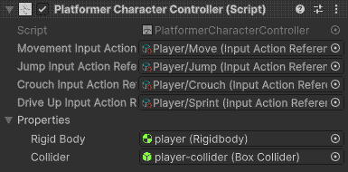

<h1 align="center"> Simple 3D platformer </h1>


```Created in Unity version: 6000.0.24f1;```<br>

 

-----------------------

<h1 align="center"> Controls: </h1>

```
A,D        -> left\right moving;
SPACEBAR   -> jump\climb up;
CTRL, C    -> crouch\climb down;
LEFT SHIFT -> dash;
```
-----------------------
<h1 align="center"> External assets: </h1>

```
BOXOPHOBIC                   -> simple fog; 
AstarPathfindingProject      -> not used in the demo project
DebugDrawingExtension        -> for best debugging;
MagicaCloth2                 -> for cloth simulations;
RealToon                     -> anime shaders;
Ropofoo - Foot Controller IK -> for foot inverse kinematics;
```
-----------------------
<h1 align="center"> Player movement main scripts: </h1>

```
|main core|
  1) PlatformerCharacterController.cs  -> The main core of player movement. This is the movement state machine. It contains the basic movement states, and methods for controlling and switching between them.
  2) AbstractMovementState.cs          -> Abstract class of the movement state. Describes the main methods of controlling the player

|additional scripts|
  1) DriveUpMovementState.cs     -> Dash movement state;
  2) StandartMovementState.cs    -> Moving, Jumping, Crouching movement state;
  3) FlyMovementState.cs         -> Debug movement state that fly;
  4) GrabStepMovementState.cs    -> Grab the edges of the surface. The player can jump or climb;
```
How it looks in inspector: <br>
 <br> 
 <br>
 <br>

-----------------------
<h1 align="center"> About scripts: </h1>
<h2 align="center"> PlatformCharacterController.cs: </h2>

In **PlatformCharacterController.cs** included class **MovementStatesManager**. All movement states can storage in initializated dictionary. Each state can use included there methods: **GetCurrentState()** and **SetCurrentState()**

```cs
public class MovementStatesManager {
        /*---| values |---*/
        public enum MovementStatesEnumerator : byte {Fly,Standart, GrabStep, DriveUp}     
        private Dictionary<MovementStatesEnumerator, AbstractMovementState> movementStates = new Dictionary<MovementStatesEnumerator, AbstractMovementState>();
        private AbstractMovementState currentMovementState;

        /*---| methods |---*/
        public void WriteStateOnDictionary(MovementStatesEnumerator stateType, AbstractMovementState state) => movementStates.Add(stateType, state);      
        public void SetCurrentState(in MovementStatesEnumerator typeState) {
            if (GetCurrentState() != null) {
                GetCurrentState().onStateWasUnfocused();
            }
            movementStates.TryGetValue(typeState, out currentMovementState);
            if (GetCurrentState().onStateWasChanged != null) {
                GetCurrentState().onStateWasChanged();
            }
        }
        public AbstractMovementState GetCurrentState() => currentMovementState;
        public Dictionary<MovementStatesEnumerator, AbstractMovementState> GetStates() => movementStates;
    }
```

In there also was initializated **Properties** class that contains all necessary values

```cs
public class Properties {
        /*---| consts |---*/
        public const float MIN_GRAVITY = -11f;

        /*---| values |---*/
        [SerializeField] private readonly PlatformerCharacterController platformerCharacterController;
        [SerializeField] private Vector2 direction;
        [SerializeField] private Rigidbody rigidBody;
        [SerializeField] private Collider collider;
        public Vector2 sharedDirection { get => direction; }
        public Rigidbody sharedRigidBody { get => rigidBody; }
        public Collider sharedCollider { get => collider; }
        public PlatformerCharacterController sharedPlatformerCharacterController { get => platformerCharacterController; }
        //...
    }
```
In **Start()** method this class initialize and write in MovementStatesManager dictionary all movements states.

```cs
private void Start() {
        //initialize properties
        properties = new Properties(this);

        //initialize movement states and writing it in states dictionary
        movementStatesManager.WriteStateOnDictionary(MovementStatesManager.MovementStatesEnumerator.Fly, new FlyMovementState() {
            speedStrength = new Vector2(5, 5),
            sharedProperties = properties,
        });
        movementStatesManager.WriteStateOnDictionary(MovementStatesManager.MovementStatesEnumerator.Standart, new StandartMovementState() {
            speedStrength = new Vector2(7, 7),
            sharedProperties = properties,
            jumpStrength = 15f,
            jumpCountMax = 2
        });
        movementStatesManager.WriteStateOnDictionary(MovementStatesManager.MovementStatesEnumerator.GrabStep, new GrabStepMovementState() {
            sharedProperties = properties,
        });
        movementStatesManager.WriteStateOnDictionary(MovementStatesManager.MovementStatesEnumerator.DriveUp, new DriveUpMovementState() {
            sharedProperties = properties,
        });
        movementStatesManager.SetCurrentState(MovementStatesManager.MovementStatesEnumerator.Standart);
        ///...
    }
```

<h2 align="center"> AbstractMovementState.cs: </h2>

This class contain all necessary methods and event actions that all time invoking by **PlatformCharacterController.cs**. All movement states are inherited from this class

```cs
public abstract class AbstractMovementState
{
    /*---| values |---*/
    public Action onStateWasChanged = () => { }; //invoked when this state became is current
    public Action onStateWasUnfocused = () => { }; //invoked when this state is losing current focus
    public PlatformerCharacterController.Properties sharedProperties;

    /*---| methods |---*/
    public virtual void FixedUpdate() {/*it's in abstract class, what are you expected see here, dumbass????*/}
    public virtual void Update() {/*it's in abstract class, what are you expected see here, dumbass????*/}
    public virtual void Jump() {/*it's in abstract class, what are you expected see here, dumbass????*/}
    public virtual void Crouch(in bool enabled) {/*it's in abstract class, what are you expected see here, dumbass????*/}
    public virtual void Dash() {/*it's in abstract class, what are you expected see here, dumbass????*/}

    public virtual void LookUp() {/*it's in abstract class, what are you expected see here, dumbass????*/ }
    public virtual void LookDown() {/*it's in abstract class, what are you expected see here, dumbass????*/ }
    public virtual void LookLeft() {/*it's in abstract class, what are you expected see here, dumbass????*/ }
    public virtual void LookRight() {/*it's in abstract class, what are you expected see here, dumbass????*/ }
    //...
}
```
